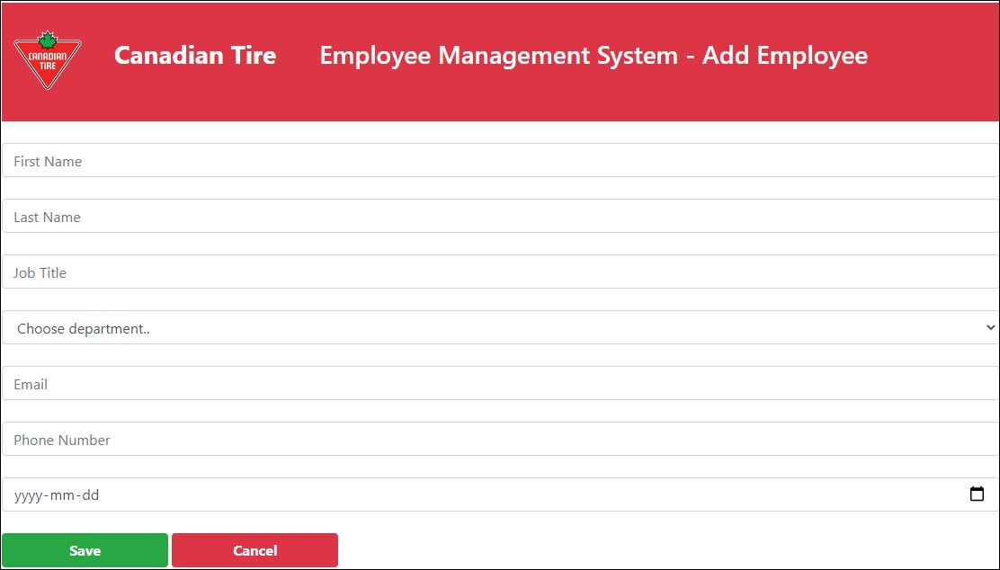

<!-- PROJECT LOGO -->
 

  <h2 align="center">Employee Management System</h2>

<!-- ABOUT THE PROJECT -->
### Web Application

A Spring Boot web application that allows you to add, delete, read, and update employees in various departments.

### Built With
* Spring Boot
* Java
* Thymeleaf
* MySQL
* Intellij

### 

   <h3 align="center">List of Employees</h3>
  
     <h3 align="center">Add New Employee</h3>
  
     <h3 align="center">Update Employee</h3>
  

